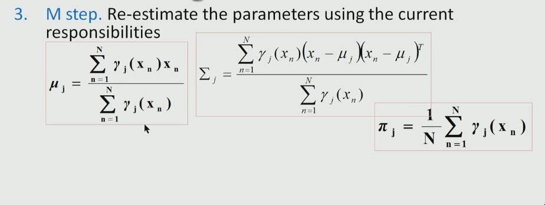

**Video Lecture**: [Ref](https://youtu.be/ZBLyXgjBx3Q)

# Gaussian Mixture Model (GMM) using Expectation Maximization (EM) technique

GMM is a powerful method for clustering (but can also be used for classification, etc.)

There maybe situations where data is not Gaussian in nature. In such cases, there are methods where we use multiple gaussian distributions such that each of the cluster forms a gaussian distribution.

Univariate Gaussian Distribution $G(x | \mu, \sigma)$

Multi-variate Gaussian Distribution

$$\mathcal{N}(x| \mu, \Sigma) = \frac{1}{(2 \pi |\Sigma|)^{1/2}}  exp \left\{ - \frac{1}{2} (x - \mu)^T \Sigma^{-1} (x - \mu) \right\}$$ 

where $\Sigma$ is covariance matrix.

**Note**: $|\Sigma|\equiv det(\Sigma)$.

We need to estimate $(\Sigma, \mu)$ of the distribution.

One method is MLE.

## MLE

- Take $ln$ of the pdf given above.
- Take derivative wrt $\mu$ and $\Sigma$ as 0.
- We get 
  $$\mu_{MLE} = \frac{1}{N} \sum x_n$$ 
  and 
$$\Sigma_{MLE} = \frac{1}{N} \sum (x_n - \mu_{MLE}) (x_n - \mu_{MLE})^T$$

# Gaussian Mixtures

Linear superposition of Gaussians

$$p(x) = \sum_{k=1}^K \pi_k \mathcal{N} (x | \mu_k, \Sigma_k)$$

where $K$ is the number of Gaussians and $\pi_k$ is the Mixing coefficient (weightage) for the $k^{th}$ gaussian distribution.

**Constraints on weights**: 

- $0 \le \pi_k \le 1$
- $\sum_{k=1}^K \pi_k = 1$

## log-likelihood

$ln\ p(X |\mu, \Sigma, \pi) = \sum_{n = 1}^N ln\  p(x_n)$.

In this case MLE does not give a closed form solution so we use EM technique.

---

Finding the best $k$ (number of Gaussian distributions) needs domain knowledge.

So, the $k$ gaussian distributions are sort of like the $k$ clusters in the data. (data being the gaussian mixture of these distributions).

## Posterior Probabilities

Also called Latent variable ($\gamma_k(x)$).

$$ \gamma_k(x) = p(k|x) = \frac{p(k) p(x|k)}{p(x)} = \frac{\pi_k \mathcal{N}(x| \mu_k ,\Sigma_k)}{\sum_{j=1}^K \pi_j \mathcal{N}(x| \mu_j ,\Sigma_j)}$$

where $\pi_k = N_k / N$. ($N$ being the number of samples).

But we don't know $N_k$. For that we use EM.

## EM

- iterative optimization technique (operated locally)
- there are $k$ mixing coefficients, means and covariance matrices. So we want to estimate these $k$ sets of parameters.
  - mean vector has $d$ values (same as the dimension of data).
  - covariance matrix has $d^2$ values.
  - mixing coefficient is just a scalar.

1. **Estimation step**: Given parameter values we compute the expected values of the latent variable.

2. **Maximization step**: Updates the parameters of our model based on the latent variable calcuted using MLE.

### EM algo for GMM

Maximize the likelihood function wrt the parameters (as discussed before).

1. Initialize the parameters with some arbitrary values (or we can be a little wise and initialize with the mean of data or something).
2. **E Step**: Compute $\gamma_k(x)$.
3. **M Step**: Re-estimate the parameters.

4. Evaluate log likelihood $ln\ p(X |\mu, \Sigma, \pi)$. If there is no convergence, return to step 2. 

Convergence criteria can be for example the parameters don't change or the log-likelihood function value doesn't change and so on.
